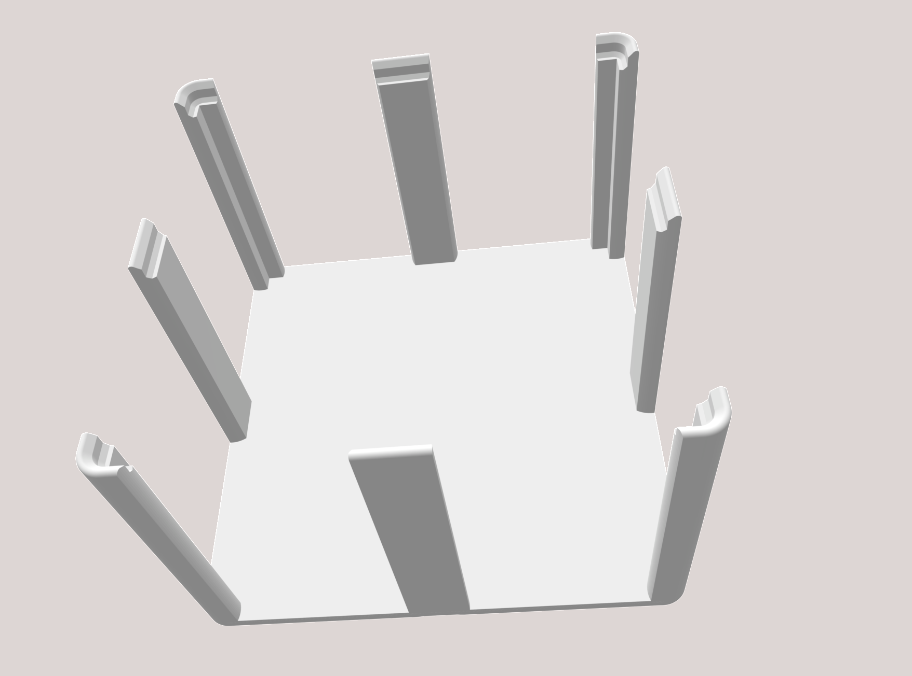
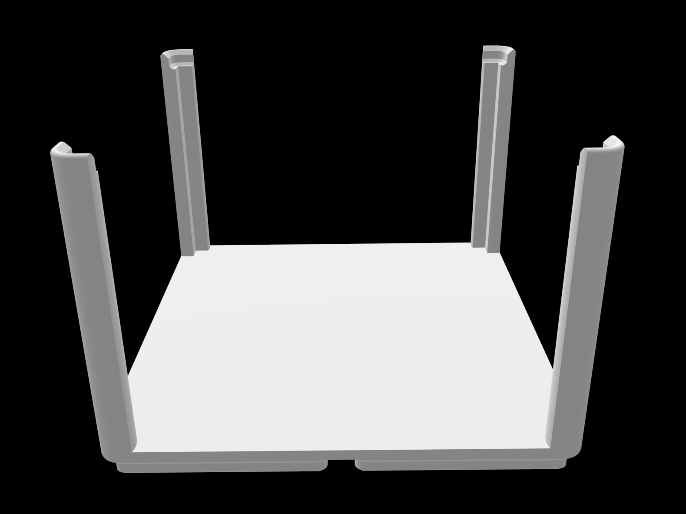

# Gridfinity 2x2 holder for 75x75mm Post-Its

This holder holds about 480 75x75mm Post-It notes. There are a few parameters you can play with, but the STL's I've included are probably what you want (although you can could adapt it for different note sizes). It is stackable, although the `mid_support` (see OpenSCAD options) aren't too sturdy, so 2x1 elements will stack, but 2x2 and greater will be more sturdy. You can remove the `mid_support`'s in OpenSCAD, if you only want to stack 2x2 or greater on top.

*Print settings:* I printed this with 5% infill, 150mm/s, 210°C, Sunlu Marble PLA.

*Requirements*: This uses kennetek's [gridfinity-rebuilt-openscad](https://github.com/kennetek/gridfinity-rebuilt-openscad). If you want to modify the openSCAD file, you'll need to import it (the code will show you where).

*Note*: The openSCAD code currently takes a very naive approach (which hardly matters in the case of such a simple model). I might tighten up the code with loops and such in the future.

`Gridfinity_PostIt.stl`

`Gridfinity_PostIt_no_mid_support.stl`
