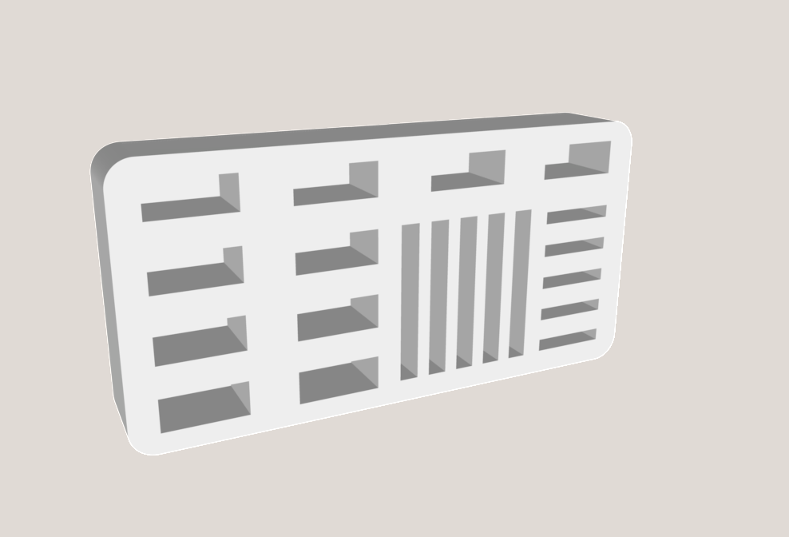

# Gridfinity 2x1 holder for USB devices, SD and micro SD cards

This holder holds **10 USB devices**, **5 SD cards** and **5 micro SD cards** simultaneously, while measuring 2.5 U in height and 2x1 U in length/width.

*Print settings:* I printed this with 5% infill upside down, to get a smooth top. This unfortunately resulted in the base beeing a bit to wide, which I had to file off. Other than that, it worked fine on my Ender S1 Pro. I might try printing it base first with 5% zig-zag infill (to hold the bottoms of the slots) and update this README accordingly.

*Requirements*: This uses kennetek's [gridfinity-rebuilt-openscad](https://github.com/kennetek/gridfinity-rebuilt-openscad). If you want to modify the openSCAD file, you'll need to import it (the code will show you where).

*Note*: The openSCAD code currently takes a very naive approach (which hardly matters in the case of such a simple model). I might tighten up the code with loops and such in the future.

*Note*: gridfinity-rebuilt-openscad has a `style_lip` option to disable the lip, which I couldn't get to work. So I chopped the top off manually.

