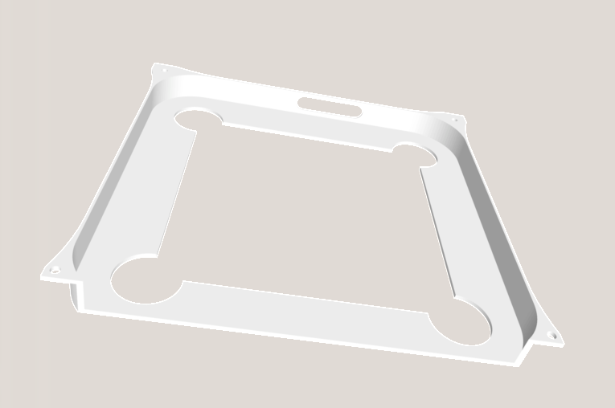
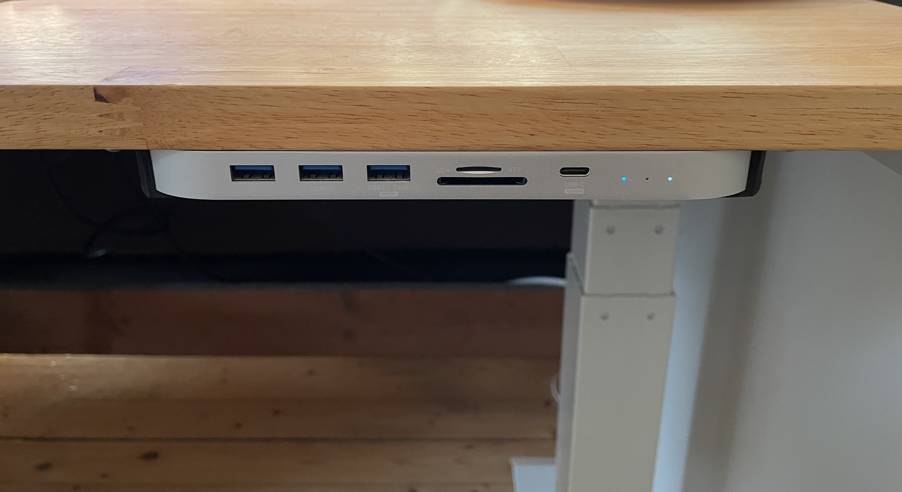
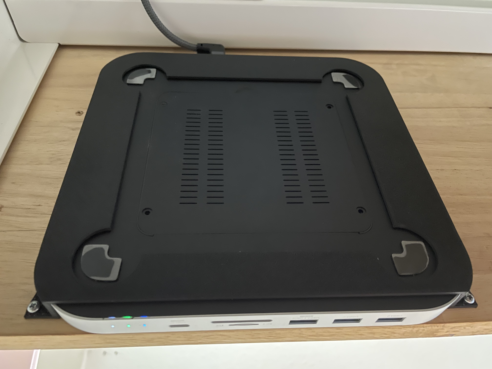

# Mac Mini Dock Mount

This lets you mount your [Hagibis Mac Mini Docking Station](https://de.aliexpress.com/item/1005002740224840.html) underneath your table top. While there are other models for this, I couldn't find one that mounts the dock flush with the table top.

The model was made to fit the **MC25 PRO** model, but should fit other models (as long as the USB C ports on the back are at the same position). The HDD/SSD hatch is still accessible when mounted (see below). You will need 4 screws (the screw holes have a diameter of about 2.2mm).

*Note*: The code isn't the tidiest, as I this was my first openSCAD project. I might revisit and tidy it up in the future.

